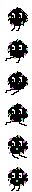
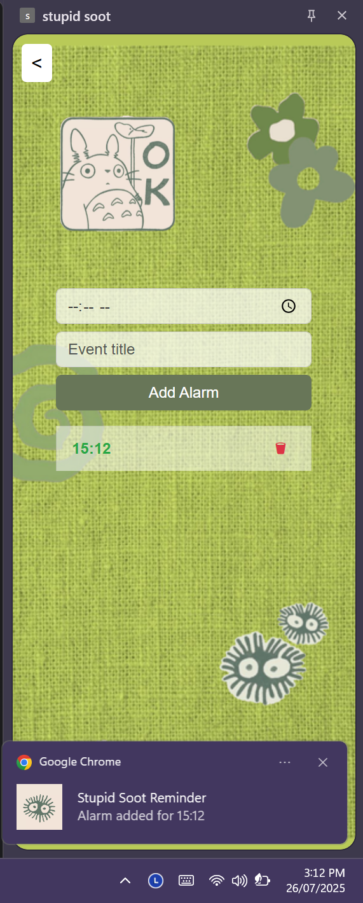
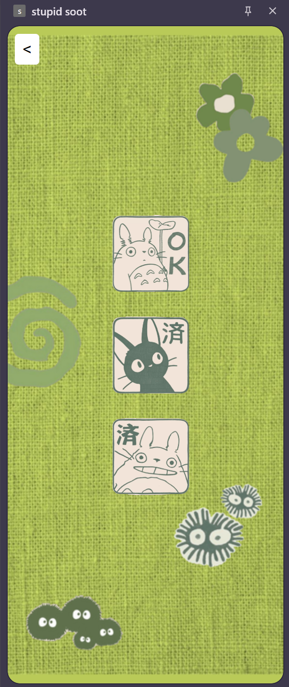
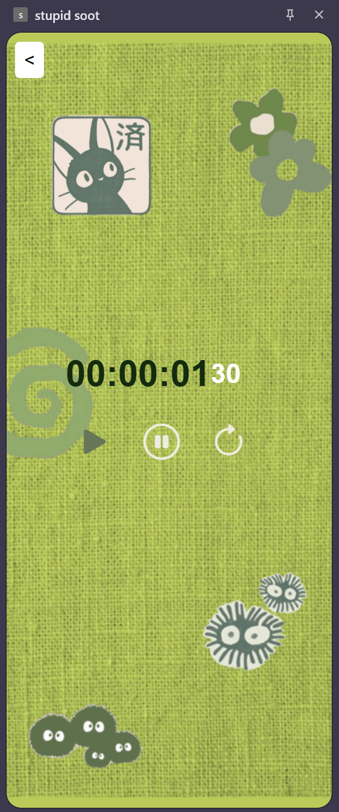
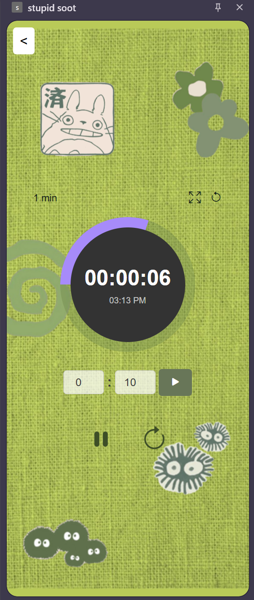
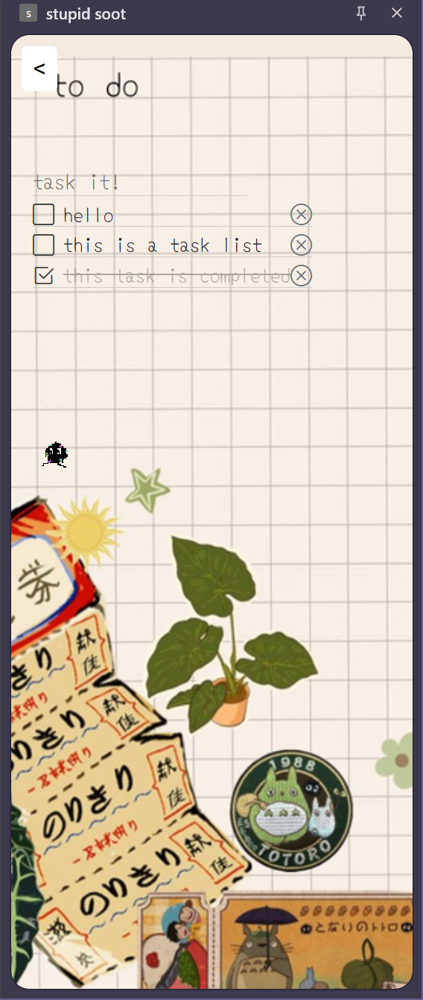
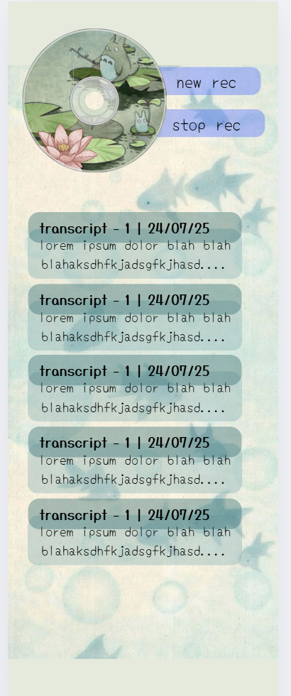

# Stupid Worm — Chrome Sidebar Extension

A productivity companion inspired by Studio Ghibli’s soot sprites. This Chrome extension integrates a whimsical element into your Browse experience while providing essential tools to keep you organized and efficient.

Every 25 minutes, a curious pixel soot appears on your screen and scampers toward your mouse. Inside the sidebar, you’ll find a To-Do list, a versatile clock, and an AI-powered note-taker that transcribes and summarizes audio from your current tab.

---

## Features

### Soot Sprite Companion

- An animated pixel soot sprite that walks, idles, and follows your mouse cursor. These sprites were hand-animated by me on [Piskelapp.com](https://www.piskelapp.com/).
- Appears every 25 minutes to provide a periodic, mindful, and entertaining presence.
- Optional interactivity allows you to drag/drop the soot sprite or let it roam freely.

### Sidebar Functionality

The extension features a dynamic sidebar accessible via the extension icon. This sidebar presents three core productivity tools in a horizontally slideable accordion style:

#### To-Do List

- A simple interface for managing and checking off your daily tasks.

#### Clock Facilities

- Alarm to set reminders.
- Stopwatch for tracking elapsed time.
- Countdown timer for focused work or breaks.

#### Notes (AI-Powered)

- Captures audio from your current browser tab.
- Transcribes the audio into text.
- Summarizes the transcript into concise, collapsible notes.

---

## AI Note-Taking Details

- **Audio Capture**: Uses `chrome.tabCapture` to record audio directly from the active tab.
- **Recording**: Audio is saved as a `.webm` file using `MediaRecorder`.
- **Flask Backend**: Audio is uploaded to a local Flask backend at `http://localhost:5000/transcribe`.
- **Transcription**: Flask converts `.webm` to `.wav` using FFmpeg and transcribes it with OpenAI Whisper (or faster-whisper).
- **Summarization**: Transcribed text is sent to `/summarize` endpoint for AI summarization.
- **UI**: Notes and transcripts are displayed as collapsible cards in the sidebar.

---

## Technical Stack

### Frontend

- **Core**: HTML, CSS, Vanilla JS
- **Structure**: Modularized in `main.js`, `clock.js`, `notes.js`, `todo.js`, and `slide.js`
- **APIs**: Chrome Extensions API for sidebar, tab capture, and offscreen document handling
- **Visuals**: Custom pixel sprite rendering for soot character

### Audio Capture & Communication

- **Tab Audio Capture**: `chrome.tabCapture`
- **Recording**: `MediaRecorder` to `.webm`
- **Upload**: `.webm` is sent to Flask server for processing

### Backend (Flask)

- **Framework**: Flask
- **Endpoints**:
  - `/transcribe`: Receives `.webm`, converts to `.wav`, transcribes using Whisper
  - `/summarize`: Returns summarized text
  - `/start`: Optional lazy model init on port 5001
- **Tools**: FFmpeg, Whisper or faster-whisper
- **Dependencies**: Flask, Whisper, soundfile, etc. (in `requirements.txt`)
- **Launcher**: The `app.py` backend can be launched via Node.js using `launcher.js`.

---

## Setup Instructions

### 1. Flask Backend Setup

```bash
cd backend/
python -m venv venv
source venv/bin/activate   # Use `venv\Scripts\activate` on Windows
pip install -r requirements.txt
python app.py
Flask will start at `http://localhost:5000`.

### 2. Chrome Extension Installation

1. Clone or download the project.
2. Open Chrome and go to `chrome://extensions`.
3. Enable **Developer Mode** (top-right).
4. Click **Load unpacked**.
5. Select the root directory (where `manifest.json` is).
6. Pin the extension from the puzzle icon in the toolbar.

---

## How to Use

### Soot Sprite

- Appears every 25 minutes
- Follows your mouse
- Support click interactions 

### Sidebar Navigation

- Click the extension icon to open sidebar
- Three tabs: To-Do, Clock, Notes
- Horizontal slide behavior

### To-Do

- Add tasks via input + Enter
- Check to mark as complete + Strikethrough
- Remove tasks 

### Clock(Three Animated Buttons)

- **Stopwatch**: Start, pause, reset
- **Alarm**: Set specific time, notifies with a “ding” sound
- **Timer**: Countdown with full control

### Notes

1. Ensure `app.py` (Flask) is running
2. Click "Start Recording" to capture tab audio
3. Click "Stop Recording"
4. Transcripts and summaries show up as collapsible cards

---
## Demos

Here are some visual examples of the extension's features and the soot sprite animations:

### Soot Sprite Animations
| Walking | Angry |
|---|---|
|  |  |

### Sidebar Tools
| Alarm | Clock | Stopwatch | Timer | To-Do List | Notes |
|---|---|---|---|---|---|
|  |  |  |  |  |  |
---

## Scope

- Soot sprite animations on click (fun reactions)
- Export/categorize notes
- Add a lap button for the stopwatch
- Allow users to add alarms with an actual clock dial interface
- Further refine sprite interaction and idle animations

---

## License

MIT License

---

## Acknowledgements

- Inspired by Studio Ghibli’s soot sprites
- Powered by OpenAI Whisper and Flask


